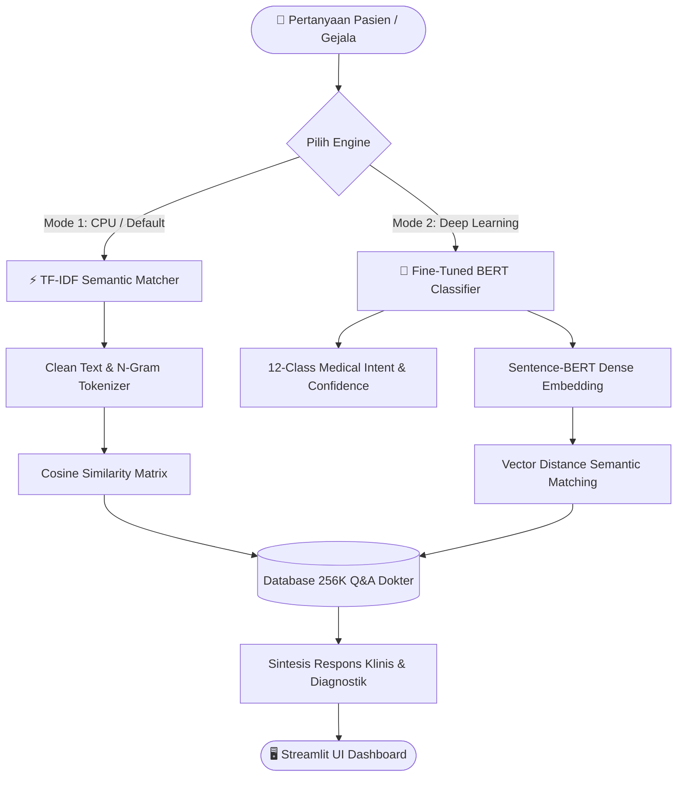

# 🏥 MediBERT: Dual-Engine NLP Medical Consultation Chatbot

[](https://www.python.org/)
[](https://streamlit.io/)
[](https://huggingface.co/)
[](https://pytorch.org/)
[](#)
[](LICENSE)

> **MediBERT** adalah sistem konsultasi dan asisten medis cerdas berbasis **Natural Language Processing (NLP)** yang dirancang untuk mengklasifikasikan keluhan pasien ke dalam **12 spesialisasi medis klinis** dan menyajikan rekomendasi penanganan dokter terverifikasi. Dilengkapi dengan **Dual-Engine Architecture** yang fleksibel (Fine-Tuned BERT Neural Network & TF-IDF Semantic Matcher).

---

## 📑 Daftar Isi
- [✨ Fitur Utama](#-fitur-utama)
- [🏗️ Arsitektur Dual-Engine](#️-arsitektur-dual-engine)
- [🗂️ 12 Spesialisasi Medis](#️-12-spesialisasi-medis)
- [🖥️ Tampilan Antarmuka (UI Dashboard)](#️-tampilan-antarmuka-ui-dashboard)
- [📁 Struktur Repositori](#-struktur-repositori)
- [🚀 Panduan Memulai Cepat (Quickstart)](#-panduan-memulai-cepat-quickstart)
  - [1. Menjalankan Web UI Lokal (Streamlit)](#1-menjalankan-web-ui-lokal-streamlit)
  - [2. Melatih Model di Google Colab](#2-melatih-model-di-google-colab)
  - [3. Menghubungkan Hasil Training ke Streamlit](#3-menghubungkan-hasil-training-ke-streamlit)
- [⚙️ Tech Stack & Library](#️-tech-stack--library)
- [⚠️ Peringatan Medis (Medical Disclaimer)](#️-peringatan-medis-medical-disclaimer)

---

## ✨ Fitur Utama

- 🧠 **Dual-Engine Architecture**:
  - **Mode BERT Deep Learning**: Menggunakan bobot transfer learning *bert-base-uncased* untuk klasifikasi intent diagnosis dan *Sentence-BERT (`all-MiniLM-L6-v2`)* untuk dense vector semantic retrieval.
  - **Mode TF-IDF Semantic Matcher**: Mesin pencarian semantik berkecepatan tinggi berbasis *Cosine Similarity* (>120 karakter jawaban dokter) yang dapat langsung dijalankan tanpa GPU.
- 🗂️ **Katalog Interaktif 12 Spesialisasi Medis**: Direktori visual 3-kolom lengkap dengan ikon, warna aksen, cakupan diagnosis, dan tombol konsultasi kasus 1-klik.
- 💬 **Live Clinical Consultation Chat**: Dilengkapi avatar percakapan interaktif, efek pengetikan bertahap (*typing streaming*), dan panel diagnostik (*Confidence Score* & *Similarity Score*).
- 📊 **Real-time Session Analytics**: Grafik frekuensi spesialisasi kasus dan tren probabilitas konsultasi secara real-time.
- 🔍 **Knowledge Base Explorer**: Mesin pencari dataset tanya-jawab medis pasien & dokter secara langsung di antarmuka web.
- 📥 **Ekspor Riwayat Konsultasi**: Fitur 1-klik untuk mengunduh transkrip sesi percakapan ke dalam format Markdown (`.md`).
- ☁️ **Seamless Colab Integration**: Fitur upload langsung file arsip training `bert_medical_assets.zip` melalui widget drag-and-drop di sidebar.

---

## 🏗️ Arsitektur Dual-Engine

Sistem menyediakan dua jalur pemrosesan untuk fleksibilitas komputasi:



---

## 🗂️ 12 Spesialisasi Medis

Model dilatih untuk mengenali gejala klinis pada 12 bidang spesialisasi:

| No | Spesialisasi Medis | Ikon | Fokus Klinis & Ruang Lingkup | Contoh Kasus Sampel |
|:---:|:---|:---:|:---|:---|
| 1 | **Cardiovascular** | ❤️ | Jantung, Tekanan Darah, Aritmia, Sirkulasi | Nyeri dada menjalar ke lengan kiri dan sesak napas |
| 2 | **Dental** | 🦷 | Kesehatan Gigi, Gusi, Infeksi Rongga Mulut | Sakit gigi berdenyut dan gusi bengkak di geraham bungsu |
| 3 | **Dermatology** | 🩹 | Kulit, Rambut, Kuku, Ruam, Jerawat Kronis | Jerawat kistik kemerahan dan gatal di seluruh wajah |
| 4 | **Endocrine** | 🔬 | Diabetes, Hormon, Tiroid, Metabolisme | Gula darah puasa tinggi (250 mg/dL), haus berlebih & lemas |
| 5 | **Gastroenterology**| 🫃 | Lambung, Usus, GERD, Asam Lambung | Perut perih terbakar, asam lambung naik, perut kembung |
| 6 | **General Medicine** | 🏥 | Keluhan Umum, Demam, Kelelahan Sistemik | Tubuh terasa lemas berkepanjangan, pusing, demam ringan |
| 7 | **Infectious Disease**| 🦠 | Infeksi Bakteri, Virus, HIV/AIDS, Demam Tinggi| Demam tinggi menggigil selama 3 hari pasca paparan infeksi |
| 8 | **Mental Health** | 🧠 | Kecemasan, Depresi, Insomnia, Serangan Panik | Serangan panik tiba-tiba, cemas intens, dan sulit tidur |
| 9 | **Nephrology** | 🫘 | Ginjal, Saluran Kemih, Infeksi Saluran Kemih | Nyeri pinggang samping disertai sensasi perih saat buang air |
| 10 | **Nutrition/Obesity**| 🥗 | Diet, Obesitas, Manajemen Berat Badan | Pola defisit kalori dan rencana nutrisi penurunan berat badan |
| 11 | **Ophthalmology** | 👁️ | Kesehatan Mata, Penglihatan Kabur, Kornea | Penglihatan mendadak buram, mata merah dan berpasir |
| 12 | **Pain Management** | 💊 | Nyeri Kronis, Migrain, Sakit Kepala, Saraf | Sakit kepala sebelah (migrain) hebat disertai mual dan silau |

---

## 🖥️ Tampilan Antarmuka (UI Dashboard)

Dashboard Streamlit dibangun dengan tata letak modular:

1. **💬 Konsultasi Medis (Live Chat)**: Konsultasi tanya-jawab real-time dengan kartu diagnostik (Confidence %, Semantic Similarity, dan referensi kasus).
2. **🗂️ 12 Spesialisasi Medis**: Katalog kartu 3-kolom untuk menjelajahi detail spesialisasi dan tombol pengujian 1-klik.
3. **📊 Statistik & Analisis Sesi**: Grafik analitik distribusi spesialisasi terprediksi dan penjelajah database (*Knowledge Base Explorer*).
4. **📖 Panduan Upload Training Colab**: Petunjuk interaktif langkah demi langkah untuk mengekspor dan mengunggah model dari Google Colab.

---

## 📁 Struktur Repositori

```text
medibert-clinical-chatbot/
├── .gitignore                      # Mengabaikan dataset besar & virtual environment
├── requirements.txt                # Dependensi paket Python
├── README.md                       # Dokumentasi utama repositori
├── PANDUAN.md                      # Panduan teknis eksekusi & instalasi detail
├── app.py                          # Aplikasi Web Streamlit (Dual-Engine Dashboard)
├── medical_chatbot_bert.ipynb      # Jupyter Notebook (Pipeline Training BERT di Colab)
│
└── [Aset Opsional Model BERT]:
    ├── bert_medical_model/         # Bobot PyTorch BERT Transformer hasil fine-tuning
    ├── label_encoder.pkl           # Pemetaan kelas 12 kategori medis
    ├── kb_embeddings.npy           # Vektor dense embeddings Sentence-BERT
    ├── knowledge_base.csv          # Basis pengetahuan Q&A hasil preprocessing
    └── model_metadata.json         # Laporan evaluasi & parameter akurasi model
```

---

## 🚀 Panduan Memulai Cepat (Quickstart)

### 1. Menjalankan Web UI Lokal (Streamlit)

1. **Clone repositori ini:**
   ```bash
   git clone https://github.com/username-anda/medibert-clinical-chatbot.git
   cd medibert-clinical-chatbot
   ```

2. **Buat dan aktifkan virtual environment (opsional namun disarankan):**
   ```bash
   python -m venv .venv
   # Windows:
   .venv\Scripts\activate
   # macOS/Linux:
   source .venv/bin/activate
   ```

3. **Install dependensi:**
   ```bash
   pip install -r requirements.txt
   ```

4. **Jalankan aplikasi:**
   ```bash
   streamlit run app.py
   ```
   *Aplikasi otomatis terbuka di browser pada alamat `http://localhost:8501`.*

---

### 2. Melatih Model di Google Colab

1. Unggah file `medical_chatbot_bert.ipynb` ke [Google Colab](https://colab.research.google.com).
2. Aktifkan GPU: **Runtime → Change runtime type → T4 GPU → Save**.
3. Jalankan sel berurutan dari Sel 1 hingga Sel 12 untuk:
   - Data cleaning & preprocessing teks medis.
   - Fine-tuning BERT Transformer untuk klasifikasi intent 12 spesialisasi medis.
   - Pembangkitan dense vector embedding Sentence-BERT.
   - Pembuatan arsip `bert_medical_assets.zip`.

---

### 3. Menghubungkan Hasil Training ke Streamlit

1. Unduh file `bert_medical_assets.zip` dari panel file Google Colab.
2. Buka dashboard Streamlit lokal (`app.py`).
3. Pada panel sidebar kiri, pilih opsi **"🧠 Model BERT Hasil Training Colab"**.
4. Tarik dan lepas (*drag & drop*) file `bert_medical_assets.zip` ke kotak upload.
5. Sistem akan mengekstrak file secara otomatis dan beralih ke mode **Neural BERT Deep Learning**!

---

## ⚙️ Tech Stack & Library

- **Language**: Python 3.9+
- **Deep Learning & Transformers**: PyTorch, Hugging Face Transformers (`bert-base-uncased`), Sentence-Transformers (`all-MiniLM-L6-v2`)
- **Natural Language Processing & ML**: Scikit-Learn (TF-IDF Vectorizer, Cosine Similarity, LabelEncoder)
- **Data Manipulation**: Pandas, NumPy
- **User Interface**: Streamlit (Glassmorphism & Dark Luxury Aesthetic), Gradio (Colab deployment)

---

## ⚠️ Peringatan Medis (Medical Disclaimer)

> **PERINGATAN**: MediBERT dikembangkan murni sebagai proyek akademik mata kuliah Natural Language Processing (NLP Semester 7). Sistem ini **BUKAN** alat diagnosis medis klinis resmi dan tidak dapat menggantikan nasihat medis, pemeriksaan langsung, diagnosis, atau tindakan pengobatan dari dokter spesialis atau tenaga medis profesional berlisensi. Jangan pernah mengabaikan anjuran dokter atau menunda mencari bantuan medis darurat karena informasi yang diberikan oleh chatbot ini.

---

## 👨‍💻 Kontributor
- **Pengembang**: Mahasiswa Semester 7 (Program Studi Teknik Informatika / Sistem Informasi)
- **Topik Proyek**: Natural Language Processing — Intent Classification & Medical Semantic Retrieval
